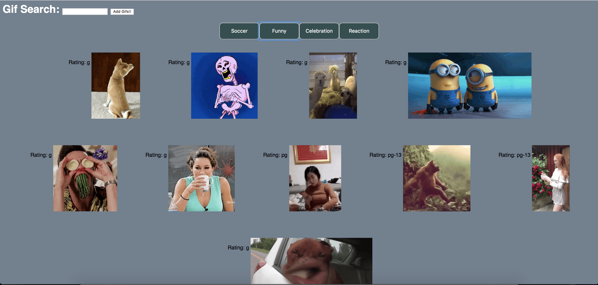

# GifTastic

This app uses GIPHY API to populate 10 gifs on the click of a button. It also allows the user to add their own category button and the user will be able to play and stop the gifs by clicking on each one individually.

Technologies used:

GIPHY API
JavaScript
JQuery

https://juanluishdz7.github.io/GifTastic/

